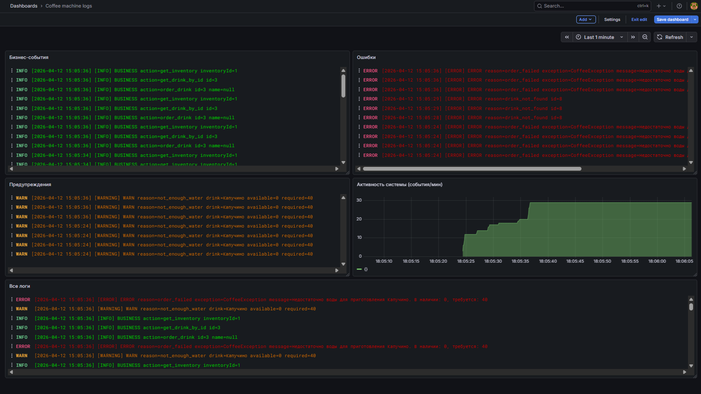
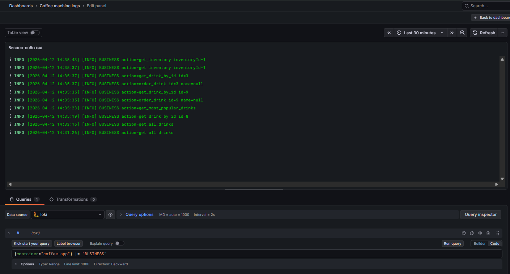
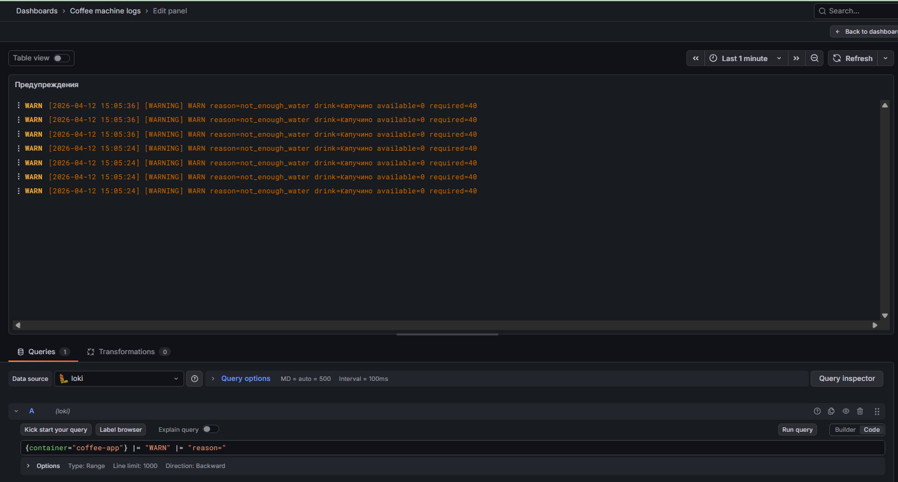
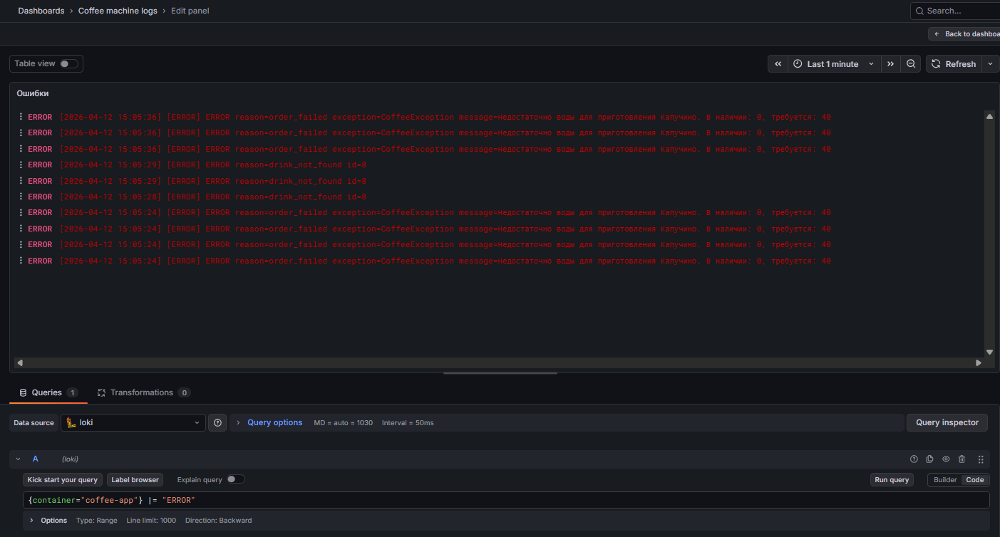
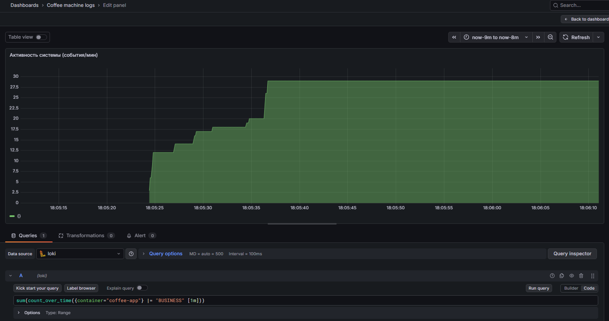
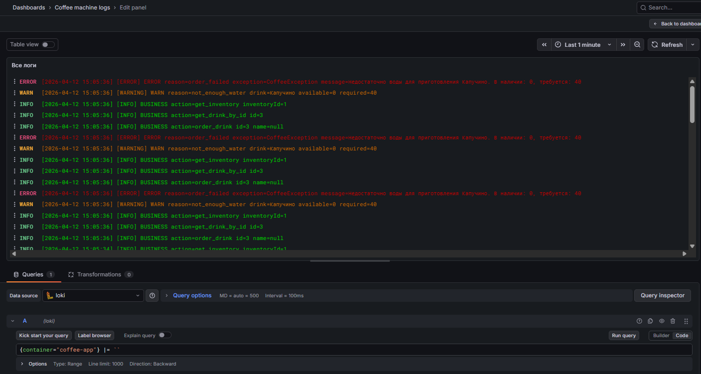

# Логи
## Принцип сбора
1. Приложение пишет логи в stdout
2. Promtail собирает docker-логи контейнера
3. Loki хранит и индексирует логи
4. Grafana используется для визуализации и анализа


## Примеры запросов
### Бизнес-события
```
{container="coffee-app"} |= "BUSINESS"
```


## Предупреждения
```
{container="coffee-app"} |= "WARN" |= "reason="
```


## Ошибки
```
{container="coffee-app"} |= "ERROR"
```


## Активность системы (события/мин)
```
sum(count_over_time({container="coffee-app"} |= "BUSINESS" [1m]))
```


## Все логи
```
{container="coffee-app"} |= ``
```
