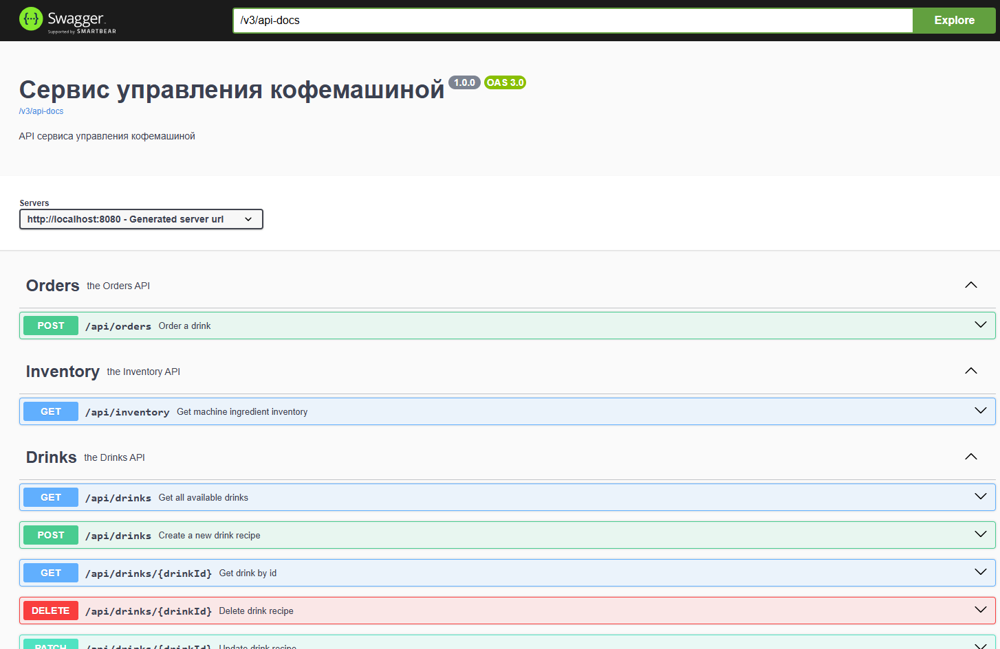
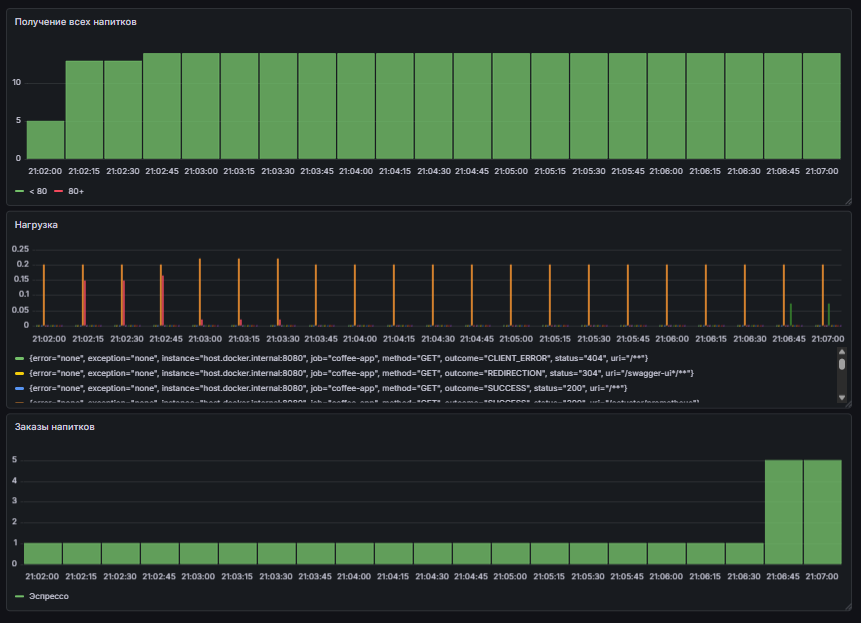

# Coffee Machine API (API-first)

Данный репозиторий содержит **API-first спецификацию** сервиса управления кофемашиной.

Спецификация API описана с использованием стандарта **OpenAPI 3.0** и выступает в роли контракта между клиентом и сервером. Реализация сервера может быть автоматически сгенерирована на основе данной спецификации.

---

## Назначение API

API позволяет выполнять следующие операции:

* получать список доступных напитков
* создавать и редактировать рецепты напитков
* заказывать приготовление напитка
* просматривать текущие запасы ингредиентов кофемашины
* получать статистику популярности напитков

---

## API-first подход

В данном проекте используется подход **API-first**, при котором:

1. Сначала проектируется контракт API (OpenAPI спецификация)
2. Затем на основе спецификации генерируется серверный код
3. После этого реализуется бизнес-логика

Такой подход позволяет:

* обеспечить единый контракт между клиентом и сервером
* упростить документирование API
* автоматизировать генерацию кода

---

## OpenAPI спецификация

Файл спецификации расположен по пути:

```
src/main/resources/openapi.yaml
```

Спецификация описывает:

* доступные эндпоинты
* структуры запросов и ответов
* модели данных
* возможные коды ответов

---

## Запуск приложения

Перед запуском убедитесь, что на компьютере установлены:

* **Java 22**
* **Maven**

### 1. Клонирование репозитория

```bash
git clone <https://github.com/yaaarslv/coffee-machine-api-first.git>
cd coffee-machine-api-first
```

### 2. Сборка проекта

При сборке Maven автоматически выполнит генерацию кода на основе OpenAPI-спецификации.

```bash
mvn clean install
```

В процессе сборки:

* из файла `openapi.yaml` генерируются интерфейсы API и модели данных;
* сгенерированный код помещается в директорию:

```
target/generated-sources/openapi
```

### 3. Запуск приложения

После успешной сборки приложение можно запустить командой:

```bash
mvn spring-boot:run
```

После запуска сервер будет доступен по адресу:

```
http://localhost:8080
```

### 4. Swagger UI

Интерактивная документация API будет доступна по адресу:

```
http://localhost:8080/swagger-ui/index.html
```


### 5. Метрики
