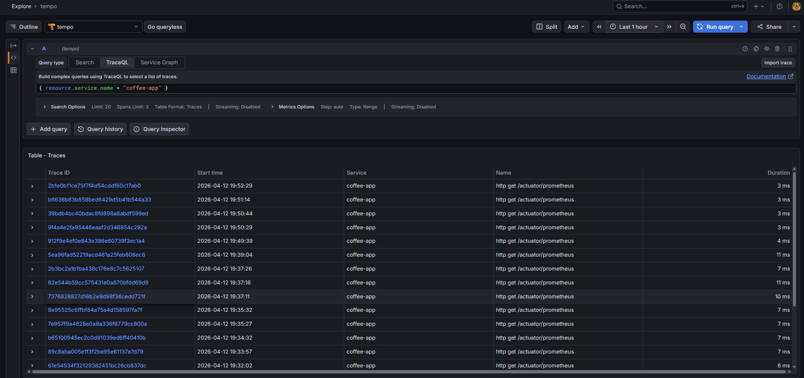
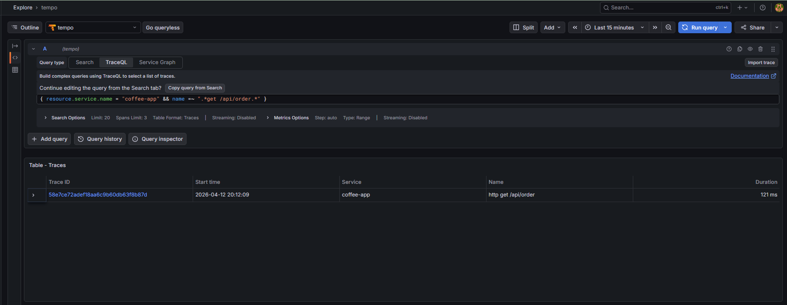
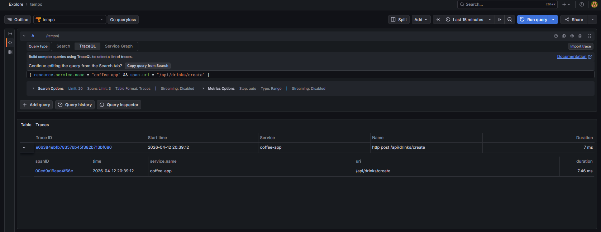
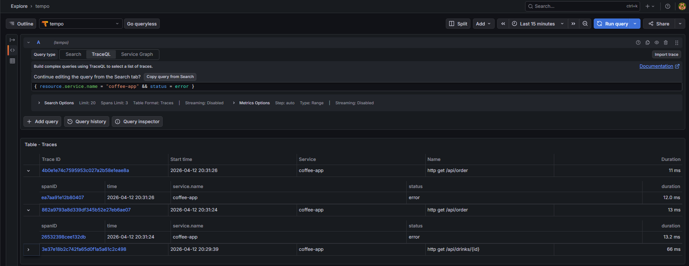
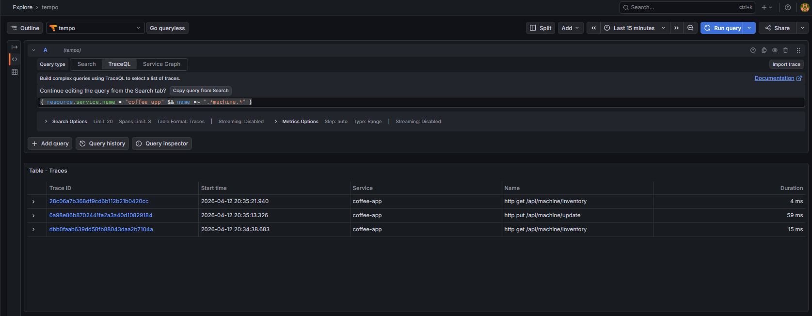
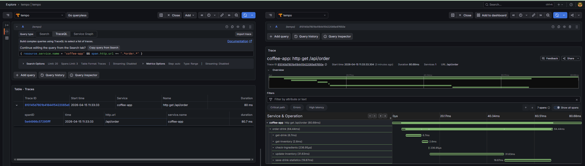

# Трейсы

## Архитектура

Spring Boot приложение -> OpenTelemetry -> OTLP -> Tempo -> Grafana (TraceQL)

Приложение генерирует трейсы автоматически для HTTP-запросов. Далее они отправляются в Tempo по OTLP и просматриваются в Grafana

## Конфигурация приложения

Для генерации и отправки трейсов были добавлены настройки:

```properties
management.tracing.sampling.probability=1.0
management.otlp.tracing.endpoint=http://tempo:4318/v1/traces
management.opentelemetry.resource-attributes.service.name=coffee-app
management.otlp.metrics.export.enabled=false
```

## Примеры TraceQL-запросов

### Все трейсы приложения

```traceql
{ resource.service.name = "coffee-app" }
```


### Любые get запросы к заказу напитка

```traceql
{ resource.service.name = "coffee-app" && name =~ ".*get /api/order.*" }
```


### Только запросы на создание напитка

```traceql
{ resource.service.name = "coffee-app" && span.uri = "/api/drinks/create" }
```



### Только ошибочные трейсы

```traceql
{ resource.service.name = "coffee-app" && status = error }
```



### Все трейсы, связанные с инвентарём кофемашины

```traceql
{ resource.service.name = "coffee-app" && name =~ ".*machine.*" }
```



### Трейс с несколькими спанами
```traceql
{ resource.service.name = "coffee-app" && span.http.url =~ ".*order.*" }
```
